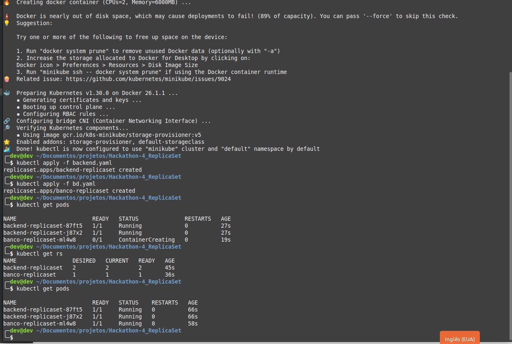
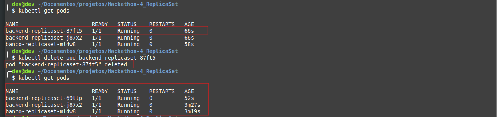
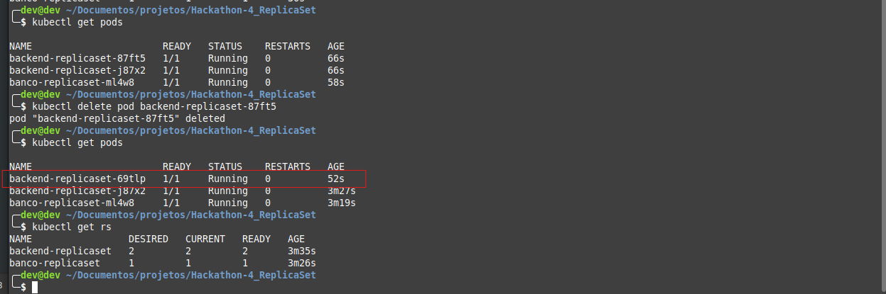

# Hackathon-4_ReplicaSet# Documentação do Projeto Kubernetes

Este documento oferece uma visão detalhada das etapas de execução de um ReplicaSet no Kubernetes, demonstrando o provisionamento e gerenciamento automático de pods. Cada etapa é documentada com capturas de tela para fornecer uma referência visual do processo.

## Kubernetes

### Criação do ReplicaSet

A imagem a seguir documenta a execução inicial do ReplicaSet, mostrando como os pods são criados automaticamente pelo Kubernetes para atender à especificação do ReplicaSet.

### Exclusão de um Pod

Esta captura de tela mostra o processo de exclusão manual de um dos pods do ReplicaSet. Este passo é importante para demonstrar a resiliência e a recuperação automática do sistema.

### Normalização do ReplicaSet

Após a exclusão de um pod, esta imagem captura o momento em que o Kubernetes automaticamente inicia um novo pod para manter a consistência do número de réplicas definido no ReplicaSet.

## Conclusão

As capturas de tela acima documentam o processo de uso do Kubernetes para gerenciar pods através de um ReplicaSet. Elas servem como uma referência visual para validar cada etapa executada no projeto, demonstrando a eficácia do gerenciamento automático de réplicas pelo Kubernetes.